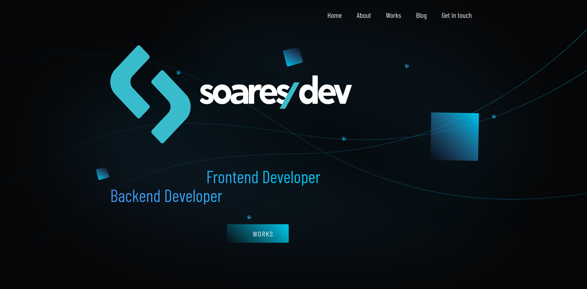
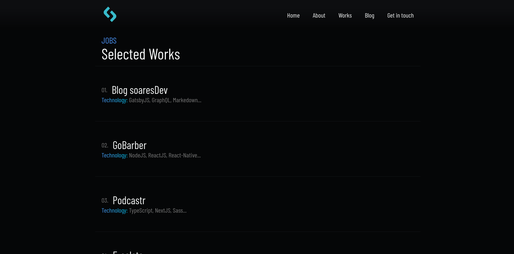
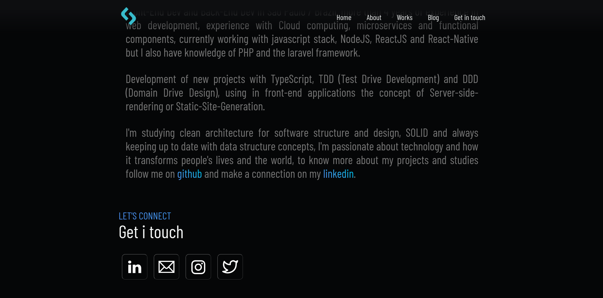

<h2 align="center">
  
</h2>

  

  

  

##### :memo: About

This is my website, where it contains information about my work and portfolio, it is an open source work and I hope I can help the community with this layout as a reference.

##### :rocket: Main technologies

<ul>
  <li><a target="_blank" href="https://dev.w3.org/html5/html-author/">HTML</a></li>

  <li><a target="_blank" href="https://sass-lang.com/documentation">Sass</a></li>

  <li><a target="_blank" href="https://devdocs.io/javascript/">Javascript</a></li>

  <li><a target="_blank" href="https://greensock.com/gsap/">GSAP</a></li>
</ul>

##### 🎨 Preview

  
  
  

